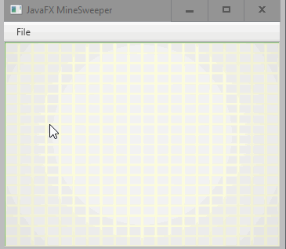
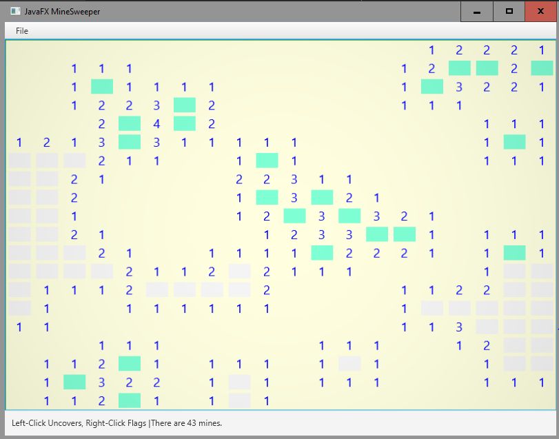

# JFX Minesweeper

This is just a fun project to learn more about JavaFX,
especially visual effects.  This game is made of an
array of 3D boxes, which I rotate in a coordinated 
fashion when spots are revealed.  I also do an explosion
effect when the player loses.

## Lessons Learned

The one snag I hit, which I spent hours working out, was:
it wouldn't display a uniform grid when the windows size 
is small.  I played with different layouts and snapToPixel 
options, and camera angles, and even switched to 2D shapes,
and nothing helped.  Finally I took away the numbers (initially,
drawn upside-down on the back of the boxes, so that they flip
into place right-side-up), and the grid was uniform at all
reasonable sizes.   So, I selected my font size more carefully, 
and all finally seems well.

The other issue, which I didn't overcome, was: the explosion effect
was, in part, done via a PathTransition.  However, using PathTransition
seemed to set all the coordinates relative to the scene, rather than the
Pane where the tiles were.  So, all the tiles would jump up and to the left, 
covering the menu bar.  It wasn't obvious how to fix that, so I changed to
a Timeline on LayoutX and LayoutY.  This worked perfectly.

